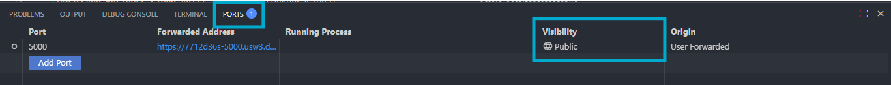
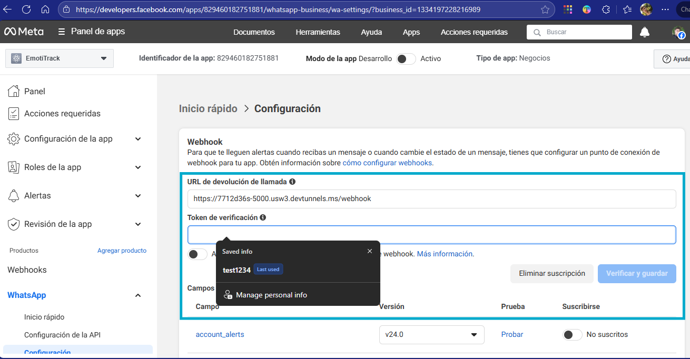

# Bot de WhatsApp para Monitoreo de Estrés y Depresión Estudiantil (DASS-21)

Este proyecto forma parte del programa **Proyectos Modulares** del CUCEI (Universidad de Guadalajara).
Implementa un **bot de entrevistas vía WhatsApp** diseñado para monitorear el bienestar emocional de estudiantes universitarios mediante el cuestionario **DASS-21 (Depression, Anxiety, Stress Scales – 21 ítems)**.

---

## Objetivos
- Desarrollar un bot de WhatsApp que envíe **recordatorios semanales** a los estudiantes.
- Capturar y almacenar las respuestas en una **base de datos** para análisis posterior.
- Aplicar **técnicas de análisis de datos** (EDA, clustering, árboles de decisión) utilizando **Polars** (o Pandas con multithreading).
- Identificar **periodos, asignaturas y contextos académicos** asociados con altos niveles de estrés y depresión.
- Proporcionar información accionable a las **autoridades universitarias** para medidas preventivas.

---

## Pila tecnológica
- **WhatsApp Business Cloud API** – interfaz conversacional.
- **Python + Polars** – procesamiento y analítica de datos.
- **Pandas (alternativa)** – con multithreading para grandes volúmenes de información.
- **Docker / Azure / AWS** – despliegue y operación en la nube.
- **LaTeX** – documentación y reportes técnicos.
- **Streamlit / Gradio / Notebooks** – tableros y visualizaciones.

---

## Estructura del repositorio

/docs – documentación técnica (reportes en LaTeX)

---

## Equipo
- **Johan Herrera** – desarrollo e integración del bot de WhatsApp.
- **Diego Escalante** – análisis de datos con Polars y modelado.

---

## Referencias
Pendiente

---

## Aviso ético
Pendiente

---

## Run test app
- Asegúrate de contar con Docker y Docker Compose instalados (`docker --version` y `docker compose version`).
- Verifica o actualiza las variables del archivo `whatsapp_bot/.env` antes de levantar los servicios.

### Despliegue local con Docker
1. Construye y levanta los servicios definidos en `docker-compose.yml` desde la raíz del repositorio:  
   ```bash
   docker compose up --build
   ```
2. Espera a que el servicio `mongo` pase a estado `healthy`; Docker iniciará automáticamente `chat-bot-api` y luego `whatsapp-bot`.
3. Confirma que FastAPI está arriba visitando `http://localhost:8000/docs` y que el bot expone el endpoint `http://localhost:5000/webhook`.
4. Para detener la pila ejecuta `docker compose down`; si deseas limpiar los datos de Mongo agrega `-v`.

### Configuración del webhook en Meta Developers
- En Visual Studio Code abre la vista **Ports** (icono del enchufe en la barra lateral o `View > Ports`), localiza el puerto donde corre la API del bot (por defecto `5000`) y cambia su visibilidad a **Public** para obtener una URL pública segura.
- Vista durante el proceso anterior:  
  
- Copia la **URL pública** generada por VS Code y añade el sufijo `/webhook` (ejemplo: `https://<tu-url>.app.github.dev/webhook`); esa será la `Callback URL`.
- Ingresa a [developers.facebook.com](https://developers.facebook.com/apps/) > tu app > **WhatsApp** > **Configuration** y, en la sección **Webhook**, presiona **Edit** o **Add callback URL** para pegar la `Callback URL`.
- Ejemplo de la sección de configuración dentro de Meta:  
  
- Usa el mismo valor definido en `whatsapp_bot/.env#L3` (`WHATSAPP_VERIFY_TOKEN=test1234`) como **Verification Token** cuando Meta lo solicite.
- Guarda los cambios; Meta verificará el endpoint llamando a `GET /webhook` y, si la API responde correctamente con el token, el webhook quedará activo para recibir mensajes entrantes.

---
